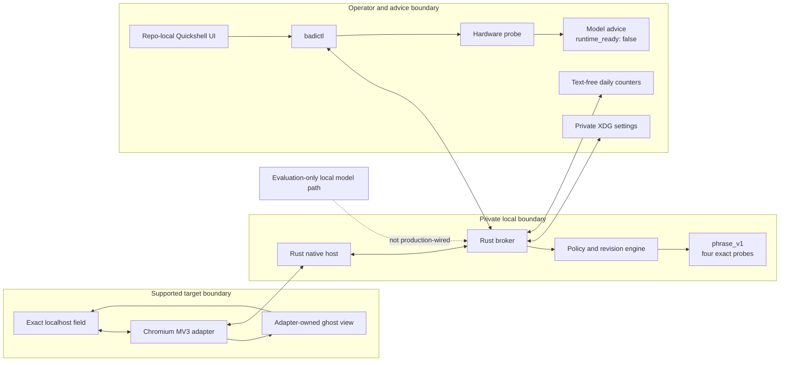
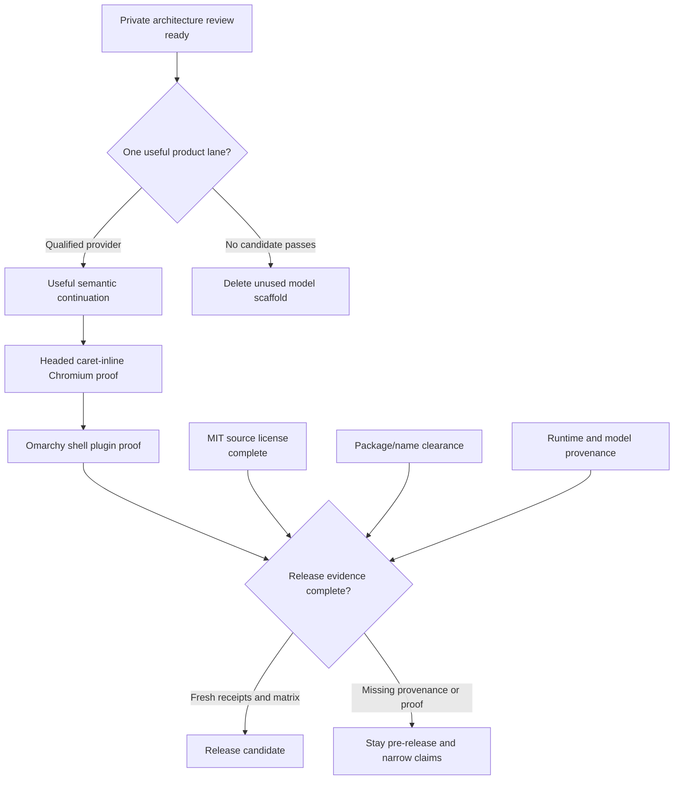

# Badi review dossier: Omarchy fit, product truth, and next proof

> - **Audience:** Badi owner, head of Omarchy, and independent architecture reviewers
> - **Prepared:** 2026-08-31
> - **Branch:** `develop`
> - **Implementation baseline:** `211982f643b00db5c7af46ef8dee4311ce6fead3`
> - **Review state:** ready for private source and architecture critique; not
>   ready for a product or interaction showing

## Executive verdict

Badi is a credible, fail-closed Linux co-writing foundation with unusually
clear trust boundaries. Its current value is architectural: target-owned text
access and edits, revision-bound suggestions, explicit policy, private IPC,
bounded local state, deterministic builds, and honest capability evidence.

It is **not yet an Omarchy-quality product experience**. Production still
serves four exact English integration probes on one localhost Chromium
fixture. The ghost surface is field-relative rather than caret-inline, the
control center is a standalone repo-local Quickshell shell rather than an
Omarchy plugin, and no semantic model has passed a Badi-owned usefulness,
latency, or runtime-attestation gate.

The repository is now explicitly MIT-licensed, matching Omarchy's license
while retaining Badi's own copyright notice. That resolves the source
license finding only. Package-name and trademark clearance, contribution
policy, model provenance, headed compatibility proof, and production runtime
ownership remain separate gates.

## System at a glance

The adapter is the only component allowed to read or mutate target text. The
broker owns policy, lifecycle, and suggestion authority. The UI consumes a
fixed `badictl` contract; it does not edit Omarchy configuration. Hardware
advice can recommend a pinned candidate but cannot download, activate, or
claim readiness for it.

## What exists today

| Surface | Current truth | Evidence class |
| --- | --- | --- |
| Protocol and broker | Strict bounded frames, revision addressing, cancellation, pause, commit authorization, and same-UID socket checks | Source, deterministic tests, historical browser receipt |
| Chromium adapter | One exact localhost document with pre-acquisition denial, ghost display, type-through, accept-word/all, dismissal, and stale fences | Source, jsdom tests, historical isolated Chromium receipt |
| Settings and policy | Versioned origin permissions, compare-and-swap updates, fail-closed revocation, private XDG persistence | Source and Rust tests |
| Control center | Standalone repo-local Quickshell window over one fixed `badictl overview` contract | Source, QML checks, isolated offscreen load |
| Production suggestions | `phrase_v1`: four explicit English probes and silence elsewhere | Source and Rust tests |
| Interaction memory | Optional origin/provider/day counts only; no prose and no adaptive-style input | Source and Rust tests |
| Hardware selection | Content-free RAM/CPU/GPU probe and conservative pinned recommendations | Source, schema tests, previously reproduced machine snapshot |
| Local semantic model | Evaluation-only artifact verification, client, and quality-gate scaffold | Source and tests; no production runtime or qualified candidate |
| Source license | MIT for Badi-owned code and documentation | [`LICENSE`](../../LICENSE) and [ADR 0002](../decisions/0002-mit-source-license.md) |

## Audit lineage

The detailed reports are intentionally preserved as snapshot evidence. Their
old statements about an uncommitted tree or missing license were true at the
time and must not be rewritten retroactively.

1. [Independent adversarial audit](2026-08-30-independent-adversarial-audit.md)
   established the initial finding set and evidence limits.
2. [Post-audit remediation handoff](2026-08-30-remediation-handoff.md)
   records the trust, lifecycle, Unicode, resource, and claim corrections.
3. [Control-center and local-intelligence handoff](2026-08-30-control-center-local-intelligence-handoff.md)
   documents the settings, Quickshell, aggregate, and model-advice foundation.
4. [GrillMe Omarchy and suggestion-quality round](2026-08-30-grillme-omarchy-quality-round.md)
   tests whether passing code and CI are being mistaken for a good product.

This dossier is the current synthesis. When it differs from an older report on
repository state, the newer dated state wins; historical measurements remain
bound to their original receipt and commit.

## Current GrillMe delta

| Challenge | Status now | What remains |
| --- | --- | --- |
| Candidate was uncommitted and had no exact-SHA CI | **Resolved for source review** | Every later review commit must still pass CI at its own SHA; CI does not prove interaction quality |
| No project source license | **Resolved** | Package/trademark clearance and contribution policy remain open |
| Durable Chromium results were presented as current | **Correctly scoped** | The 1,000 insertion trials, 100 stale trials, and 12.6/0.6 ms p95 values remain historical until reproduced on a new headed candidate |
| Production has no general writing intelligence | **Open, product-blocking** | Qualify one semantic provider against an owned corpus and real visible-path clock |
| Control center is not Omarchy-native | **Open, product-blocking** | Port the stable contract to a disabled-by-default Omarchy shell plugin and use shared theme primitives |
| Browser surface is not caret-inline product UX | **Open, product-blocking** | Headed caret placement, native undo, zoom/DPI/scroll, hostile CSS, and framework-field proof |
| Model scaffold may exceed earned product scope | **Open, maintainability risk** | Stop expanding it; qualify one lane and delete unused surface |
| Accept keys can be consumed on late authorization denial | **Open, interaction risk** | Headed evaluation of pre-authorization or a dedicated non-native gesture; never synthesize replay |
| Multilingual output could be inferred from Unicode plumbing | **Explicitly unsupported** | Language-specific output-policy fixtures before any Persian, Arabic, CJK, or emoji claim |

## Evidence ledger

| Evidence | Result | Binding and limitation |
| --- | --- | --- |
| [Implementation-baseline CI](https://github.com/ahuray/badi/actions/runs/33336422618) | Green | Exact source verification for `211982f`; not headed product evidence |
| [Chromium native receipt](../../capabilities/chromium-native-live.v2.json) | 1,000 insert/caret trials, 100 stale trials, 12.6 ms accept-to-insert p95, 0.6 ms invalidation-to-hide p95 | Historical, hash-linked to its recorded source and isolated environment |
| Current Rust/TypeScript/QML suites | Deterministic source checks | Can pass while ordinary prose remains silent or headed placement feels wrong |
| Quickshell offscreen load | Configuration parsed and stayed alive for the bounded run | Does not prove theme, focus, scaling, accessibility, or Omarchy plugin behavior |
| Model-advice schema and artifact pins | Conservative recommendation contract | Does not prove runtime installation, authentication, latency, memory pressure, or writing quality |

## Readiness path

### Ready now

- Private review of protocol, Rust boundaries, policy, adapter lifecycle,
  evidence discipline, and the control contract.
- Review of whether the architecture is compact enough for the single product
  lane it currently proves.
- Review of the same-UID trust decision and model-runtime ownership plan.

### Required before a product showing

1. Freeze a small private English completion corpus and evaluator with explicit
   useful/quiet/unsafe labels.
2. Qualify at most one pinned local candidate through the actual
   schedule-to-visible path; retain `phrase_v1` only as an integration fixture.
3. Replace the field-width panel with calm, headed-proven caret-inline ghost
   text in one real editor surface.
4. Move the stable UI contract into Omarchy's shared shell/plugin and theme
   boundaries, disabled by default.

### Required before release

1. Produce fresh commit-linked headed receipts and publish an exact
   app/version/capability matrix.
2. Own and authenticate the local runtime, bind it to the verified artifact,
   and test cancellation, pressure, restart, and power behavior.
3. Complete package-name/trademark clearance and define the contribution and
   release workflow.
4. Audit every distributed model, tokenizer, dataset, dependency, and generated
   artifact under its own license; MIT covers only Badi-owned material.

## Questions for an Omarchy reviewer

1. Is a small disabled-by-default shell plugin the right eventual control
   surface, or should Badi expose only status/actions for an Omarchy-owned UI?
2. Which shared theme, focus, notification, and lifecycle primitives should the
   integration consume instead of reproducing locally?
3. Does the current same-UID and explicit-target trust boundary fit Omarchy's
   expectations for a local co-writer?
4. Which single headed path would constitute a credible first product proof:
   Chromium textarea, CodeMirror/Obsidian, or another native surface?
5. Which parts of the evaluation scaffold look earned, and which should be
   deleted before the first semantic lane?

## Recommended next action

Freeze a 100-case, content-private English inline-completion corpus and its
single schedule-to-visible measurement contract. Evaluate at most one pinned
candidate without automatic activation. If it cannot beat the deterministic
baseline on usefulness, quietness, safety, and latency, delete the unused
runtime scaffold instead of adding abstractions.

That is the shortest path from an elegant foundation to evidence that Badi is
worth integrating into Omarchy.
