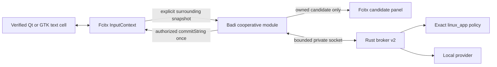

# Badi Fcitx5 native-app handoff

Status: implementation and exact live compatibility proof, 2026-09-01

This handoff records the narrow native Linux slice added on `develop`. It is
not a generic Qt, GTK, Wayland, or Fcitx support claim.

## Outcome

Badi now has a cooperative Fcitx5 module with visible proof in two exact native
text surfaces on the tested machine:

| Cell | Context | Presentation | Insertion | Live result |
| --- | --- | --- | --- | --- |
| Omawrite 0.5.0, Qt 6 | Fcitx surrounding text | Fcitx candidate panel | one `InputContext::commitString` | 20/20 visible accept/clear/undo trials |
| Xournal++ 1.3.7, GTK 3 text tool | Fcitx surrounding text | Fcitx candidate panel | one `InputContext::commitString` | 20/20 visible accept/clear/save/undo trials plus one Escape dismissal |

The live cell was Arch Linux, Hyprland 0.56.2, native Wayland, and Fcitx5
5.1.21. `keyboard-us` remained selected throughout. Other versions,
applications, toolkits, text surfaces, input methods, and compositors are
unsupported until separately tested.

These are exact compatibility cells, not runtime widget selectors. Fcitx
provides an exact process identity and an opaque input-context UUID, but no
stable application widget identity. The runtime boundary is therefore the
allowlisted process plus an explicit user chord in an eligible focused native
text context. The adapter sends `identity_known:false` and purpose `unknown`,
so the broker can authorize only the explicit-manual path. No behavior in
other fields of those processes is claimed.

## Architecture



The addon is `Category=Module`; it does not register or replace an input
method. It observes Fcitx events after the active input method and yields when a
foreign preedit or candidate panel is present.

The product path contains no raw input capture, clipboard insertion, synthetic
typing, title-based identity, or fallback mutation route. A temporary external
acceptance driver generated physical-class shortcuts for the live matrix
because the addon deliberately ignores virtual input. That driver is not
product code and is removed before handoff.

## Interaction and authority

- `Ctrl+Shift+Space` requests one suggestion from a freshly read native
  surrounding-text snapshot.
- `Ctrl+Shift+Y` accepts only an owned, visible, unexpired, exact-revision
  candidate.
- `Escape` dismisses only an owned visible candidate.
- Unrelated keys pass through. Modifier-only events do not clear a visible
  candidate.
- Every suggestion and commit is bound to session UUID, focus epoch, revision,
  salted fingerprint, request/control ID, suggestion ID, and exact text.
- A matching `commit.prepare` is consumed once. The addon re-reads the full
  native context immediately before one `commitString` call.
- Fcitx cannot prove the client applied a commit, so the adapter reports only
  `dispatched-unverified`. The saved Omawrite file and decompressed Xournal++
  XML provide the visible application-level proof.

Session policy uses activation `always` so the broker can install a known exact
application rule. Context acquisition remains manual: no text is serialized
until the invoke chord, and each context frame declares `activation:"manual"`
and `explicit:true`.

## Privacy and coexistence

The allowlist contains only:

```text
omawrite
com.github.xournalpp.xournalpp
```

The noncanonical `xournalpp` identity is rejected. Native-app learning is
blocked until personalization has a versioned Linux identity; retention is
`none` in this slice.

The deterministic suite verifies that these conditions produce no outbound
context or commit authority:

- missing surrounding-text capability, sensitive, disabled, special-purpose,
  composing, selected, malformed, oversized, or unknown-language native
  context;
- unknown or noncanonical application identity;
- foreign input-method preedit or candidates;
- stale focus, revision, fingerprint, suggestion, control, or expired lease;
- unavailable native context; and
- duplicate commit preparation.

Toolkit surrounding-text notifications are not trusted merely because they
arrive during a shortcut. The addon takes a fresh native snapshot and preserves
the revision only when the complete capture still matches byte-for-byte. Any
change or unavailable/sensitive state revokes local authority immediately.
A new focus epoch starts ineligible and becomes capturable only after a
post-focus surrounding-text update. A capability change resets that latch, so
a toolkit cannot carry a cached buffer from one native focus object into the
next one.

## Live matrix method

### Omawrite

The disposable Omawrite profile opened a temporary Markdown file containing
the deterministic `thank you` trigger. Each trial used the native Fcitx
candidate and commit route, verified the saved continuation, cleared the
candidate, and restored the baseline through the application's undo path.

Result: 20/20 successful trials.

### Xournal++

Xournal++ ran with disposable config and data roots. Each formal trial:

1. selected the GTK text tool through the application's exported action;
2. created a real text object containing the deterministic trigger;
3. invoked Badi and accepted the owned Fcitx candidate;
4. saved the document;
5. decompressed the `.xopp` file and verified the accepted text element;
6. invoked Xournal++'s native document undo action;
7. saved again and verified the accepted object was gone while the baseline
   document remained.

Result: 20/20 successful trials. A separate Escape trial incremented broker
dismissals, did not prepare a commit, and left the saved document without the
suggestion.

### Post-hardening smoke

After adding the focus-epoch freshness latch, both exact cells were exercised
again against the final code:

- Omawrite saved `thank you for your time`, then its native undo restored
  `thank you`.
- Xournal++ visibly committed the same completion, its saved `.xopp` XML
  contained `thank you for your time`, then its exported native undo action
  removed the text object from the saved document.

The isolated final-smoke broker ended with two suggestions and two commit
preparations, zero stale results, zero commit failures, and zero sessions. Its
two provider errors were deliberate empty-context focus diagnostics and
produced no suggestion or commit. Temporary live-control helpers, disposable
profiles/documents, the user-local addon files, and the isolated broker were
then removed. The ordinary Fcitx session was restarted with `keyboard-us`; all
five pre-test Fcitx configuration hashes were unchanged.

The final content-free broker snapshot after both app matrices and diagnostic
probes was:

```json
{
  "sessions": 0,
  "context_updates": 81,
  "provider_calls": 81,
  "stale_results": 0,
  "suggestions_shown": 78,
  "suggestions_expired": 11,
  "dismissals": 23,
  "commits_prepared": 43,
  "commits_applied": 0,
  "commit_failures": 0,
  "provider_errors": 3
}
```

`commits_applied` remains zero by contract: native Fcitx commits are reported
as `dispatched-unverified`. The three provider errors came from diagnostic
invocations with the caret away from the exact deterministic trigger; they
produced no suggestion or commit. The formal Xournal++ matrix added exactly 20
commit preparations with zero commit failures.

## Defects found by the live path

The real apps exposed integration defects that isolated state tests did not:

1. `session.open` used manual activation while installed native policy required
   `always`. The session and explicit context roles are now separated.
2. Modifier-only events and unchanged toolkit surrounding-text republishes
   revoked a valid candidate. Exact native snapshot comparison now preserves
   only truly unchanged authority.
3. `control.result` arrived before `commit.prepare` and was missing from the
   strict transport allowlist. Only the requested `accept_all` and `dismiss`
   results are accepted.
4. Broker `suggestion.clear` legitimately omits optional `suggestion_id`, while
   the addon required it. The parser now accepts the two schema-defined exact
   shapes and still rejects `null`, extra keys, and malformed IDs.
5. Escape cleared local UI without notifying the broker. It now sends a
   revision-bound dismissal before clearing.
6. Xournal++ assigns `Ctrl+Shift+Y` to another tool. Badi consumes it only while
   its owned current candidate exists; otherwise the native shortcut remains
   untouched.
7. Broker authority changes retire every old session before broadcasting the
   new epoch. The addon now invalidates local leases without sending a stale
   `session.close`, then reopens only after the new authority permits it.
8. Duplicate focus-in events now close the prior owned broker session before
   replacing its local binding, preventing an orphaned session.
9. Qt can retain a same-window surrounding-text cache across native focus
   objects. Capture now requires a post-focus surrounding-text update, and
   focus-out or capability changes reset that freshness latch. Precommit uses
   the same guarded live-context path.

Each protocol correction has a deterministic regression test.

## Build, install, and rollback

The strict local build is:

```sh
npm run fcitx5:check
```

The dated Arch CI cell installs CMake, Ninja, GCC, Fcitx5, and nlohmann-json in
a digest-pinned Arch container and runs the equivalent configure, build, and
CTest commands directly, without adding Node.js to the C++ job.

For the scoped user-local evaluation and exact rollback commands, use the
[module runbook](../../adapters/fcitx5/README.md). The tested user-local loader
requires explicit `FCITX_DATA_DIRS` and `FCITX_ADDON_DIRS`; this should not be
treated as release packaging.

## Remaining limits

- No generic Fcitx, Qt, GTK, terminal, or multilingual claim.
- No stable widget identity from Fcitx; fields outside the two tested cells are
  unverified even inside the allowlisted processes.
- No ambient native completion; invocation is manual-only.
- No partial-word native acceptance yet; only whole-suggestion acceptance.
- No native application learning or retained prose.
- No package install/upgrade/downgrade lifecycle, signed artifact, or V3
  capability receipt yet.
- No proof with a foreign input method selected in a real app; coexistence and
  zero-context behavior are deterministic contract tests in this slice.
- No stronger result than `dispatched-unverified` at the Fcitx boundary.

Those limits are intentional. A new application is added only as a new exact
compatibility cell with its own focus, context, sensitive-state, candidate,
commit, dismissal, undo, and rollback evidence.
