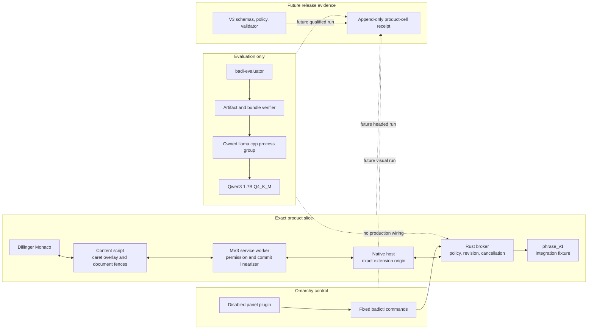

# GrillMe implementation handoff

> - **Prepared:** 2026-09-01
> - **Branch:** `develop`
> - **Bounded source-review baseline:** `b7183efe07f244a02c62e35f24b02d0d410f6f85`
> - **Review verdict:** ship the source; no remaining Critical, High, or Medium
>   code or evidence-integrity blockers
> - **Product status:** pre-release; no V3 product-cell receipt; semantic
>   production activation remains disabled

The baseline above is the exact source tree reviewed in this handoff. It is
not eligible as a future V3 `repository.commit` after this documentation commit
lands: V3 permits only new evidence files after its recorded clean commit. A
future qualification must first freeze a later clean source-and-documentation
SHA, run every final proof at that SHA, and add only evidence afterward.

## Outcome

The GrillMe round is implemented as one deliberately bounded product proof,
not as a broad Linux typing claim. Badi now has:

1. one exact Dillinger/Monaco adapter path with optional user-granted access,
   caret-relative suggestion UI, a dedicated acceptance command, and one
   target-native undo transaction;
2. one evaluation-only, hardware-aware local-model lane with exact artifact
   provenance, a supervised `llama.cpp` process, streaming observations, and
   fail-closed English scope/output guards;
3. one disabled-by-default Omarchy panel plugin using the host's shared shell
   components and a bounded `badictl` process lifecycle; and
4. one protected V3 evidence contract that can represent a future product
   proof without rewriting historical V1/V2 evidence.

The normal broker still uses `phrase_v1`. The small real-model run did not pass
the frozen semantic qualification checks, and the headed/visual/approval gates
are incomplete. The implementation therefore does not claim useful general
writing intelligence, arbitrary-site support, release readiness, or Omarchy
installation.

## Architecture delivered



The adapter remains the only component allowed to read or edit document text.
The broker owns policy and suggestion authority. The evaluation lane cannot be
selected by normal broker composition, and the Omarchy plugin does not edit
live Omarchy configuration.

## What changed

### Dillinger product slice

- Added a separate MV3 product manifest with only the optional
  `https://dillinger.io:443/*` host permission.
- Restricted execution to the exact top-level `https://dillinger.io/` document,
  active visible tab/window, focused visible Monaco editor, and explicit
  `language: "en"` request scope.
- Added ephemeral content-script registration after permission grant and
  invalidation on revoke, pause, navigation, replacement, worker/session
  restart, or a newer request.
- Added a one-shot commit linearizer. The final authority/epoch/grant check and
  target edit dispatch occur in the same synchronous worker turn.
- Added a suggestion-only caret overlay with viewport clamping and five-point
  occlusion rejection. It does not impersonate Monaco text decorations.
- Added exact Monaco snapshot/edit integration. `Ctrl+Shift+Y` inserts the
  authorized suffix as one target-native operation while preserving focus and
  scroll, so Monaco owns undo/redo.
- Added disposable product and probe runners with private HOME/XDG/profile,
  socket, native manifest, and process cleanup. Cleanup failure is a failed run.

### Local semantic evaluation

- Split the former local-model scaffold into the normal compact selection
  contract and feature-gated `semantic`/`evaluation` modules.
- Added exact model, archive, loader, and full runtime-directory manifest
  verification. The directory contract covers sorted regular files and safe
  same-directory symlinks and rejects extras, special files, escaping links,
  missing targets, cycles, and same-content replacement.
- Added pre-spawn, post-spawn, post-ready, and pre-evidence reverification.
- Added a private loopback server challenge with a fresh bearer secret, a
  wrong-token negative check, process-group ownership, bounded shutdown, and
  Drop retry after failed termination.
- Added streaming TTFT/body-byte observations, truncation rejection, and a
  Latin/Common English output gate.
- Enforced missing/non-English abstention before request serialization: the
  verified `fa`, `ar`, `zh`, and missing-language cases sent zero request-body
  and zero response-body bytes.
- Kept every receipt `evaluation_only` and `production_ready: false`.

### Omarchy integration

- Replaced the 12-file standalone Quickshell control center with one
  repo-local `panel` plugin under `ui/omarchy-plugin`.
- Reused Omarchy shell/theme primitives and fixed `badictl` argument shapes.
- Added generation and stale-exit guards, queued reopen behavior, TERM-then-KILL
  teardown, unload cleanup, and an exact Dillinger authority display.
- Added portable and pinned-host validation. CI uses the canonical
  `omacom/omarchy` repository at commit
  `346e69e1cec6c4e8924531874af6ba010a1bc99e`, a digest-pinned Arch image,
  the 2026-08-31 Arch package snapshot, Quickshell `0.3.1-1`, and Qt
  Declarative `6.11.2-1`.
- Hardened the isolated harness around a private session/process group. It
  validates exact temporary HOME ownership, escalates TERM-resistant children,
  and fails if any group member survives.

### Control and evidence integrity

- Repaired durable deny ordering so revocation does not depend on repairing
  unrelated corrupt aggregate state.
- Added V3 run/product-cell schemas and a frozen policy for exact roles,
  chronology, artifacts, compatibility, metric derivation, thresholds, and
  qualification-digest binding.
- Added protected `capabilities/v3/validator.mjs` ownership of V3 signal
  classification, location/version/schema identity, fixed-schema loading,
  semantic dispatch, and append-only interpretation.
- Kept the generic checker on V1/V2 mappings and protected V3 delegation.
- Made capability discovery reject `.json` symlinks/directories instead of
  silently omitting them.
- Made both comparison gates reject all-zero, self, unresolvable, and divergent
  non-ancestor supplied bases. Local package gates default to `HEAD^`; CI
  supplies an event-specific base and fails closed when it is unavailable.
- Preserved the historical V2 manifest policy before narrowing current product
  permissions. No V3 receipt was manufactured from development observations.

## GrillMe disposition

| Finding | Disposition at the source-review baseline |
| --- | --- |
| H1: no useful writing intelligence | **Partially addressed.** A real pinned model is supervised and measured, but it failed final semantic checks and remains evaluation-only. |
| H2: not Omarchy-native | **Source artifact addressed.** A real Omarchy panel plugin and pinned-host lifecycle gate exist; live install and human visual/accessibility review remain open. |
| H3: unbound claims | **Mechanism addressed.** V3 is strict and append-only; no claim receipt exists until fresh final-SHA runs and approvals occur. |
| M1: accept key can swallow native behavior | **Design addressed for Dillinger.** Acceptance uses extension-owned `Ctrl+Shift+Y`; no Tab/key replay fallback exists. Full headed delivery remains a manual gate. |
| M2: scaffold exceeds product | **Addressed.** The duplicate shell was deleted; production selection stays compact; semantic code is isolated behind one evaluation feature. |
| M3: multilingual output unsupported | **Addressed by scope.** Only explicit `en`/`en-*` can reach the model and non-Latin/emoji output is rejected. Multilingual support is not claimed. |
| M4: panel is not inline UX | **Partially addressed.** Real Monaco caret-relative rendering, occlusion, edit, and undo/redo pass the probe; a human-headed theme/zoom/scaling matrix remains open. |
| M5: runtime not process-authenticated | **Substantially addressed for evaluation.** Exact supervised artifacts, fresh secret, private loopback, and process ownership are enforced. Same-UID hostility and system DSO dependencies remain explicit constraints. |
| M6: revoke depends on store repair | **Addressed.** Restrictive authority is installed/revoked before optional state reconciliation, with regression coverage. |
| L1: licensing | **Source license addressed.** Badi-owned source/docs are MIT; package-name, trademark, model, dataset, and dependency terms remain separate release work. |

## Verification ledger

All results below were reproduced from the implementation tree before this
handoff was added.

| Gate | Result |
| --- | --- |
| Rust format and clippy | `cargo fmt --all -- --check` and all-feature clippy with `-D warnings` passed |
| Rust behavior | 188 tests passed across unit, integration, semantic, protocol, CLI, and shutdown suites |
| Rust MSRV | Rust 1.85 all-target/all-feature locked check passed |
| Chromium | TypeScript passed; 17 Vitest files / 143 tests passed |
| Evidence | 26 V3 policy/validator/additions tests passed; historical 2 receipts / 1 raw run passed; V3 receipts: 0 |
| Builds | Fixture and product extension outputs were identical across two clean builds |
| Documentation | 213 local Markdown links and fragments passed |
| Omarchy | Strict source/host checks passed; 100 healthy cycles and TERM-resistant cleanup passed |
| Workflow/shell | `actionlint`, `shellcheck` in the plugin gate, and `git diff --check` passed |
| Reviewer | Final integrated adversarial re-audit: ship; no remaining Critical/High/Medium blockers |

### Real Chromium/Monaco probe

The disposable headless probe used Chromium `151.0.7922.173` on Arch Linux and
the live Dillinger Monaco implementation:

- extension worker and popup/product assets loaded;
- exact snapshot succeeded;
- insertion/undo/redo caret offsets were `9 -> 23 -> 9 -> 23`;
- focus and scroll were preserved;
- viewport clamping and five-point occlusion rejection passed;
- original disposable document was restored; and
- the profile was removed with zero browser processes remaining.

The probe intentionally excludes the user permission prompt, native-messaging
broker chain, and content-script-to-worker routing. The headed full-chain
runner reached the permission/registration boundary, but compositor focus
remained on Ghostty without the owner's click. That is an honest manual gate,
not release evidence.

### Real pinned-model observation

The machine-selected writing candidate was Qwen3 1.7B Q4_K_M:

- model: `Qwen3-1.7B-Q4_K_M.gguf`, 1,282,439,264 bytes,
  SHA-256 `d2387ca2dbfee2ffabce7120d3770dadca0b293052bc2f0e138fdc940d9bc7b5`;
- runtime: llama.cpp `b10726`, source revision
  `85c55223caf0a2ad0d1d88e5a73ab3fe36107867`;
- loader SHA-256
  `4c20c6b55baa75eafeb02c17f118ce93314ba69aef89a9b4156284d58dcbc0c8`;
- archive SHA-256
  `d3c4e406b2911c8c75d2d0858459645960f8f592c1ab372d565cf145b870c901`;
- runtime-bundle manifest SHA-256
  `d1dad3f66d4064b1c2a6d9dc7c824d3d50d2639f3b1d3dd22c7f4355edb99cba`.

The content-free six-case run produced four zero-byte language abstentions,
one 18-character suggestion (`108,212 us` TTFT, `320,033 us` elapsed), and one
truncation (`89,664 us` TTFT, `566,054 us` elapsed). Scope guard, runtime
ownership, raw-run derivation, and provenance passed. Output-script and
streaming-TTFT qualification failed, so activation correctly remains disabled.

The hardware snapshot reported x86_64, 20 logical CPUs, AVX2, 15,663 MiB total
RAM, an Intel GPU with no claimed usable accelerator memory, and unknown power
state. Advice selected the balanced candidate but returned
`runtime_ready: false`.

## Reproduce the bounded proof

From the repository root:

```sh
npm ci
npm run check

# Contract-level real Dillinger/Monaco probe, no permission prompt
npm run live:product:probe --workspace @badi/chromium -- \
  --chromium-executable /usr/bin/chromium

# Owner-driven full chain: approve the exact prompt, focus Monaco,
# type "thank you", accept with Ctrl+Shift+Y, then return and press Enter
npm run live:product --workspace @badi/chromium -- --interactive
```

Inspect hardware and conservative candidates without downloading anything:

```sh
cargo run --quiet -p badi-broker --bin badictl -- hardware --json
cargo run --quiet -p badi-broker --bin badictl -- models writing --json
```

Run the semantic fixture or an already-present exact candidate explicitly:

```sh
cargo run -p badi-broker --features local-model-eval --bin badi-evaluator -- \
  fixture-self-test

cargo run -p badi-broker --features local-model-eval --bin badi-evaluator -- \
  pinned-development /path/to/Qwen3-1.7B-Q4_K_M.gguf \
  /path/to/llama-server \
  /path/to/llama-b10726-bin-ubuntu-x64.tar.gz
```

Those exact basename leaves are part of the candidate contract; the evaluator
does not download or accept renamed artifacts.

No command above installs the Omarchy plugin. Validate its isolated artifact
without touching live configuration:

```sh
npm run omarchy:check
omarchy plugin validate ui/omarchy-plugin
BADI_SUMMON_CYCLES=100 bash ui/omarchy-plugin/tests/run-isolated.sh healthy
```

## Remaining release gates

- Owner-approve and seal the 100-case English corpus/rubric, then pass the
  complete quality, quietness, unsafe-output, latency, cancellation, memory,
  and power protocols through the final visible path.
- Complete one owner-driven headed Dillinger full-chain run and the visual
  theme, zoom, scale, focus, accessibility, and hostile-CSS matrix.
- Install neither model runtime nor Omarchy plugin automatically. Package and
  rollback them only after their respective qualification/owner decisions.
- After all source and documentation changes, freeze a new clean V3 candidate
  SHA. Run the final proofs and obtain the owner, Omarchy-reviewer, and
  GrillMe-reviewer approvals defined by V3 at that SHA, then add only new
  append-only raw-run and product-cell files in a later evidence commit.
- Resolve public package/name/trademark and contribution-policy decisions.

## Rollback and cleanup

The source-review commit can be reverted as one source change without
rewriting historical evidence. The product runner is disposable and restores
the target document, removes its temporary browser/native/socket state, and
reaps owned processes. The Omarchy artifact is not installed, so rollback is
currently deletion of the repo-local plugin only. No `llama-server`, evaluator,
temporary Badi watcher, or disposable Chromium process remained after the
recorded checks.

Remote CI is intentionally not claimed by this document: the handoff is added
after the source-review commit so it can name that exact baseline. The final
documentation commit must be pushed and pass CI at its own exact SHA before the
branch is considered delivered. That documentation SHA is the earliest commit
that could become a V3 candidate anchor; any later source or documentation
change requires a newer clean anchor.
