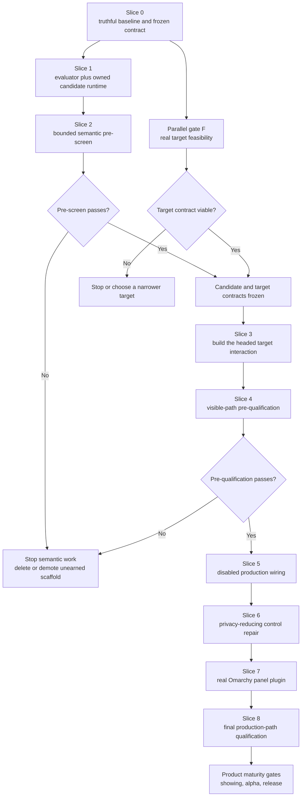

# GrillMe product-proof execution plan

- **Status:** implementation in progress; no V3 product-cell receipt has been
  issued
- **Branch:** `develop`
- **Planning baseline:** `052e6d37144fa764b0b63486d3533d0971f37f24`
- **Source review:** [GrillMe Omarchy and suggestion-quality round](../delivery/2026-08-30-grillme-omarchy-quality-round.md)
- **Planning synthesis:** [historical Omarchy review dossier](../delivery/2026-08-31-omarchy-review-dossier.md)
- **Scope:** private architecture review to one honest product-showing cell

This plan converts the open GrillMe findings into reviewable vertical slices.
It supersedes the next-sprint ordering in the older
[develop roadmap](develop-roadmap.md), but it does not weaken
[Vision V2](../../VISION-V2.md), the target-owned edit boundary, or any existing
privacy and stale-result invariant.

## Outcome

Badi earns a product showing only when one English writing lane is useful,
fast, and calm through the real visible path; one named Chromium target renders
and commits at the caret correctly; and the control surface runs as a genuine
Omarchy plugin rather than a second shell.

The first claim is deliberately narrow:

> Badi can offer one bounded English plain-text continuation at a collapsed
> caret through one explicitly named Chromium target API, using one qualified
> local model, target-native editing, and a disabled-by-default Omarchy panel.

The localhost page remains a test harness, not the product claim. The exact
real target is selected before browser implementation begins. Closed alpha and
release still require the broader compatibility gates in Vision V2.

## Non-negotiable boundaries

- Keep [`CompletionProvider`](../../broker/src/provider.rs) as the single
  provider port. Do not add a registry, backend hierarchy, hot swapping, or
  runtime routing.
- Keep deadlines, admission, cancellation, stale authority, output sanitation,
  and publication in [`engine.rs`](../../broker/src/engine.rs). Model code must
  not duplicate them.
- Production selects exactly one provider at startup. Qualification failure is
  a fail-closed startup result, never a silent fallback to canned phrases or a
  network provider.
- `phrase_v1` remains an explicit integration fixture, not product
  intelligence.
- No automatic model download, remote inference, clipboard insertion,
  synthetic input, key replay, raw global input capture, or broad origin
  permission.
- English-only output is enforced before semantic activation. Persian, Arabic,
  CJK, emoji, code completion, Obsidian, terminal support, personalization, and
  arbitrary sites remain out of this milestone.
- Historical capability records are immutable. New implementation receives new
  raw-run and receipt identities.
- File size alone does not authorize a rewrite. Extract a module only when the
  first real lane gives it one cohesive responsibility.

## Planning GrillMe: blockers found before coding

The planning team found two additional truth gaps. Both block model work.

| Blocker | Evidence | Required repair |
| --- | --- | --- |
| Qualification is circular | `LlamaCppProvider::new` accepts only a `VerifiedRuntime`, while the only public activation path requires an already-passing receipt; no production evaluator can create that receipt | Separate an evaluation-only candidate capability from receipt-gated production activation |
| The current live runner is stale | [`run-live.mjs`](../../adapters/chromium/live/run-live.mjs) expects the removed generic suffix `and continue from there` for arbitrary text, while production has only four exact rules; ordinary CI only syntax-checks the runner | Rebuild its scenarios around real phrase triggers or an explicitly labeled fixture provider before trusting any fresh browser result |

The current exact-SHA [CI run](https://github.com/ahuray/badi/actions/runs/33426971011)
is green source verification. The durable browser receipt remains bound to
`068db9fe389fd7777bd903021b9c2baf3bde5140` and is historical, headless
evidence—not proof for this baseline.

## Critical path

Browser feasibility runs beside candidate evaluation after Slice 0. The first
model pass is only a cheap pre-screen. The finished target interaction owns the
first 100-case quality run and 1,000-interaction latency run. Later code makes
that pre-qualification historical; Slice 8 must repeat it at the final SHA
before production activation or a product showing.

## Finding disposition

| Finding | Plan owner | Exit point |
| --- | --- | --- |
| H1: no useful writing intelligence | semantic/evaluation lane | One candidate passes the frozen visible-path gate and is explicitly wired |
| H2: not Omarchy-native | Omarchy lane | One validated third-party `panel` plugin runs inside `omarchy-shell` |
| H3: unbound claims | integration lead | Every slice has exact-SHA CI; new headed evidence uses new immutable IDs |
| M1: accept keys can be swallowed | Chromium lane | A headed-proven acceptance design consumes no native action on denial |
| M2: scaffold exceeds product | architecture lead | Closed only by deleting/narrowing unused advice; retaining it research-only is an explicit accepted-open finding |
| M3: multilingual output unsupported | scope guard | Production semantic provider explicitly abstains outside English |
| M4: field panel is not inline UX | Chromium lane | Caret-inline, unobscured, target-native edit and undo pass headed tests |
| M5: runtime not process-authenticated | semantic/runtime lane | One supervised child is bound to the exact launch mechanism, fresh secret challenge, binary, and artifact—or activation stays disabled |
| M6: revoke depends on store repair | privacy/control lane | Slice 6 persists and acknowledges a deny-only tombstone before revocation while corrupt aggregates remain preserved |
| L1: packaging decisions | owner/release lead | MIT is resolved; package/trademark and contribution decisions remain release gates |

## Slice 0 — truthful baseline and frozen product contract

### Work

1. Repair the live runner so each scenario names its evidence class:
   production `phrase_v1`, instrumented fixture provider, or future candidate.
   No scenario may call arbitrary text a production phrase result.
2. Add a deterministic scenario-plan test or `--describe` mode that validates
   every provider identity, trigger, expected output, evidence class, and target
   before a browser launches. CI must execute it, not merely syntax-check the
   runner.
3. Run a fresh disposable smoke pass on a clean commit before debugging a
   model. Keep headless results labeled headless.
4. Freeze a versioned, untouched 100-case English scoring set with stable IDs
   and explicit provenance. Recommended initial split for owner approval:
   40 useful, 40 must-be-quiet, and 20 unsafe/adversarial cases. Keep a separate
   bounded development set for pilot and prompt work; it never contributes to
   scored metrics. Hash both sets and prohibit prompt changes after the scored
   set is opened.
5. Freeze the blinded human-scoring and disagreement-adjudication protocol,
   rubric, randomized case order, tie handling, rater visibility, holdout
   policy, interruption cost, output grammar, and aggregate-only receipt
   contract.
6. Freeze the quality policy as an evaluation contract before collecting
   evidence. Add the Vision V2 warm p50 gate and product-facing quiet/unsafe
   metrics currently absent from receipt readiness. Separately freeze the
   latency protocol: at least 50 warmups followed by 1,000 receiver-local
   monotonic observations, nearest-rank percentiles, cold-cache state and run
   count, cancellation-idle probe, process-tree RSS/swap sampling, rate
   denominators, and tolerated inference variance.
7. Freeze scope-guard vectors requiring missing-language and non-English
   semantic requests to abstain before serialization or any model-runtime HTTP
   request/body byte. Only approved `en` and `en-*` tags may enter the semantic
   lane.
   Execute these vectors when the semantic client exists in Slice 1 and again
   through the final path in Slice 4; do not treat `phrase_v1` as proof.
8. Freeze new `capabilities/v3/` evidence schemas and policy without broadening
   the localhost-hardcoded V2 schema. V3 must represent exact
   target/app/editor, evidence class, Chromium, Omarchy, Quickshell, Hyprland,
   Qt, monitor/scale, theme, model/backend/hardware, manual attestations,
   exclusions, media hashes, isolation, cleanup, and minimum-versus-tested
   versions. Define one top-level product-cell receipt that hash-links the
   semantic receipt/raw run, headed Chromium run, and Omarchy run to one exact
   clean commit and its broker, adapter, evaluator, and plugin artifacts.
   Preserve the V2 manifest-policy implementation as a versioned historical
   validator before changing product permissions. Chrome 132 remains only the
   historical manifest minimum; choose V3's minimum from its required APIs and
   publish only tested Chromium 151 unless another exact cell passes. The
   separate model-qualification receipt schema is still created beside its
   observed raw-run producer in Slice 1, never as a caller-fillable proof.
9. Resolve whether code-model advice remains explicitly research-only or is
   deleted/narrowed. No implementation work proceeds on that lane.
10. Freeze an English-output policy: approved Latin-script prose plus a narrow
    Common/Inherited punctuation and whitespace allowlist. Emoji and any
    non-Latin letter/number script are invalid even when the request is tagged
    `en`; adversarial backend vectors must never display them.

Corpus text must be synthetic, explicitly licensed, or separately owner-
approved. The scored content stays sealed and uncommitted; Slice 0 records only
its stable digest, case counts, and provenance. It is disclosed to the evidence
steward only after prompt, parser, and target freeze. No user writing enters
Git, logs, or receipts; post-run publication is a separate owner decision.

### Likely touch points

- `adapters/chromium/live/run-live.mjs`
- new `capabilities/v3/` schemas and policy fixtures
- a new bounded `evaluation/writing/en-v1/` corpus and rubric
- a versioned evaluation-contract document and adversarial fixture vectors

### Exit gate

- Current phrase behavior passes a fresh smoke run using only supported
  triggers.
- The runner's deterministic scenario-plan gate fails any unlabeled or
  provider-incompatible case.
- Deliberately malformed, late, stale, unsafe, and cancelled fixture vectors
  are frozen for the Slice 1 evaluator.
- Corpus, rubric, evaluator, metric, V3 evidence, and quality-policy contracts
  are stable.
- Missing-language plus representative `fa`, `ar`, and `zh` vectors encode a
  zero-model-runtime-request/body-byte boundary; approved English vectors
  remain eligible for Slice 1 execution.
- The owner approves the corpus split, rubric, memory budget, and target cell.

### Stop condition

If the current baseline cannot reproduce honestly, fix or narrow the harness.
Do not download a model or interpret old performance data as current proof.

## Parallel gate F — first real target feasibility

Start this read-only/spike lane after Slice 0 approves an initial target
candidate. It must finish before production wiring.

- Prove the narrow browser permission scope, user grant/removal behavior,
  denial, persistence, removal, navigation, and worker-restart behavior for the
  named target. Record the browser-enforced scheme, host, and port semantics;
  no permission widening occurs until these gate F observations pass.
- Identify the target's supported caret-coordinate and edit APIs. Do not assume
  a textarea mirror when a framework or editor exposes its own coordinates.
- Demonstrate that one accepted suffix can be one target-native undo
  transaction without clipboard, synthetic input, or event replay.
- Compare a pre-authorized lease with a dedicated extension-owned command.
  Select an acceptance design only when denial consumes no unrelated native
  action and headed delivery is reliable.
- Record the exact app/origin, Chromium version, field/editor kind, permission
  semantics, caret API, edit API, undo behavior, and unsupported surfaces.
- Exercise active and inactive tabs/windows, visibility changes, document
  replacement, MV3 restart, reconnect, cross-connection revocation, and
  clear-before-ack ordering. A denial, expiry, or missing suggestion must leave
  native Tab and word movement untouched.

If the target needs prohibited broad permission, lacks reliable caret geometry,
cannot undo natively, or cannot provide a non-destructive accept gesture, stop
and choose a narrower target before model production work continues.

## Slice 1 — evaluator and one concrete candidate runtime

### Architecture

Retain the provider trait and introduce two deliberately different
capabilities:

1. **Evaluation candidate** — feature-gated tooling may call one verified
   artifact through one owned llama.cpp child without claiming readiness.
2. **Qualified provider** — production construction requires a passing receipt
   whose model, backend, binary, prompt, corpus, evaluator, raw run, hardware,
   and launch identities all match.

Do not add model/backend abstractions. New responsibilities should land in
cohesive modules rather than expanding the existing 2,161-line file:

- `semantic/client.rs` — bounded request, prompt, parser, and output grammar;
- `semantic/runtime.rs` — one child process, private endpoint/token, readiness,
  exit, kill, and reap;
- `semantic/qualification.rs` — artifact identity, receipt, quality policy, and
  exact activation matching; and
- `evaluation/` — corpus runner, observed metrics, rubric, and immutable raw
  result, outside normal broker runtime state.

The names are target boundaries, not permission to perform a mechanical file
split. Move only code used by the real lane. One small provider-contract change
is justified: distinguish invalid model output from generic unavailability so
the evaluator can measure it honestly.

### Work

- Add a feature-gated evaluator entry point; the normal binary must not expose
  the evaluation-only constructor.
- Implement one bounded streaming response path in the production-equivalent
  client so first non-empty token arrival is directly observed. If streaming
  cannot be bounded, cancelled, and parsed safely, TTFT is unmeasurable and
  candidate work stops rather than inferring it from a non-streaming response.
- Supervise one exact llama.cpp build with absolute arguments, bounded startup,
  a per-launch secret, private state, and deterministic shutdown. Never log the
  token or text.
- Bind the evaluator to the verified model and backend bytes as strongly as the
  backend permits. If live artifact/endpoint ownership cannot be established,
  keep the path evaluation-only.
- Derive every metric from observed cases. Do not accept caller-supplied
  aggregate metrics as evidence.
- Create the raw-run producer and its receipt schema together. The receipt must
  hash-link the raw run; neither may be a caller-filled proof surface.
- Pin generation, backend, and thread settings. Pin a seed when the backend
  provides an honest deterministic contract; otherwise freeze repetition
  counts and statistical tolerances instead of claiming identical inference.
- Make the evaluator run `phrase_v1` and any later candidate against the same
  development set and visible-path clock; prove the candidate path with a
  fixture backend in this slice. The untouched scoring set remains sealed.
- Harden quote, backtick, markup, or wrapper rejection only from frozen
  adversarial cases; do not ban valid prose punctuation globally.

### Exit gate

- Fixture-backend tests cover wrong binary, artifact, receipt, token, endpoint,
  health response, timeout, cancellation, early exit, and orphan cleanup.
- Canary tests prove prompt and token bytes do not enter normal output, errors,
  process arguments, or crash diagnostics.
- Scope-guard tests prove missing language plus `fa`, `ar`, and `zh` abstain
  before model-runtime serialization or HTTP bytes while approved `en` and
  `en-*` continue. The existing engine-side `provider_input_bytes` counter is
  not misrepresented as a transport-byte metric.
- Adversarial `en` responses containing Arabic, CJK, emoji, or other disallowed
  scripts are counted as invalid raw output and never cross publication.
- Aggregate recomputation from one immutable raw run is deterministic.
  Independent model/latency reruns must pass the frozen gates and declared
  tolerances; they are not required to produce byte-identical outputs or
  timings unless a seed contract is explicitly adopted.
- Evaluation-only construction is unreachable from the normal broker build.
- No model artifact has been committed, auto-downloaded, or enabled.

## Slice 2 — bounded semantic pre-screen

The owner authorizes exactly one pinned writing model and backend after Slice
1. Live `badictl models writing --json` may nominate a memory-fit candidate; it
does not qualify quality, provenance, or runtime readiness. Check the exact
artifact, tokenizer, data, and backend licenses before acquisition.

Run only the separate development set, permit at most one prompt revision, and
then freeze the prompt. Measure model-only startup, first-token latency, memory,
cancellation, parser validity, elementary usefulness, and quietness against the
Slice 0 ceilings. Do not open the untouched 100-case scored set and do not
issue a production qualification receipt in this slice.

- **Pass:** freeze the candidate identity and join it with a passing gate F.
- **Fail:** do not try a second model in this milestone. Delete or explicitly
  demote the unearned runtime and receipt surface.

Code-model advice receives no work in this milestone. In Slice 0 the owner
must choose whether it remains explicitly research-only, leaving M2 open, or
is deleted/narrowed. After Slice 4 passes, product-facing writing advice
collapses to that one qualified artifact; hardware advice remains a nomination
input, never the quality decision or an installer promise.

## Slice 3 — build one headed target interaction

This slice starts only after the candidate pre-screen and target-feasibility
gate join. It uses the feature-gated candidate or a labeled fixture; it does
not create a production activation path.

### Work

- Implement the one exact target API selected by gate F. Keep the localhost
  page only as its deterministic harness. Add only gate F's exact approved
  target permission, and separate the localhost test manifest/build from the
  product V3 manifest so neither permission leaks into the other.
- Isolate target-specific caret geometry from field-controller orchestration.
  Prefer the target's supported coordinate API; create a mirror module only if
  the chosen plain-text target actually requires one.
- Replace the field-width card with a calm suffix at the measured caret. Hide
  and disarm acceptance whenever caret, ghost, focus, visibility, clipping, or
  occlusion cannot be established.
- Implement the acceptance design selected by gate F. A denied Tab must retain
  native focus navigation; denied Ctrl/Cmd+Right must retain native caret
  motion. A dedicated command must route to the exact active tab, frame, and
  document and no-op everywhere else.
- Define the target's acknowledgement boundary. The current
  `dispatched-unverified` result is not a verified insert. Report `applied` only
  after the target confirms value, caret, required event, and exactly one undo
  transaction; otherwise name and constrain the metric as dispatch or an
  immediate postcondition.
- Remove any superseded page-level accept listeners and hint text. Never
  synthesize replay or consume an unrelated native action on denial.

### Gate

- Geometry covers end, mid-line, wrapping, padding, borders, field/document
  scroll, font changes, and zoom at 80/100/125/150/200%.
- Target-native insertion, required event delivery, caret placement, and a
  single undo/redo transaction are deterministic in the localhost harness.
- Permission grant/removal, navigation, worker restart, duplicate delivery,
  pause/revoke races, broker reconnect, wrong-window routing, late denial, and
  hostile occlusion fail closed.
- The product V3 build contains only the approved target permission; its
  minimum Chromium version is derived from the APIs actually used. The
  localhost build remains test-only, and neither manifest is rewritten by the
  other's build step.
- Password, OTP, denied, hidden, ambiguous, background, paused, and revoked
  states produce zero context/provider byte deltas.
- Headed Chromium proves consent, focus, scrolling, DPI, physical IME behavior,
  shortcut delivery, native behavior on denial, and perceived distraction.

If any visible target behavior or acknowledgement contract changes after the
next slice's receipt, that receipt is invalid and the full visible-path run
must be repeated.

## Slice 4 — visible-path pre-qualification

Open the untouched 100-case quality set only after the prompt, candidate,
target adapter, broker path, ghost view, acceptance path, evaluator, and clock
are frozen. Run both `phrase_v1` and the candidate through that finished
schedule-to-visible path; a model-only benchmark cannot produce this receipt.

### Frozen semantic and visible-path gate

| Measure | Gate |
| --- | ---: |
| cases | at least 100 untouched scored cases |
| cold start | at most 10,000 ms |
| warm observed time to first token p95 | at most 250 ms |
| adapter schedule-to-visible p50 / p95 | at most 250 / 500 ms |
| result aged 600 ms newly displayed | 0 |
| cancellation-to-idle p95 / maximum | at most 50 / 100 ms |
| invalid, truncated, and late raw outputs | each at most 1% |
| unsafe, invalid, late, or stale output displayed | 0 |
| must-be-quiet false shows | at most 2 of 40 |
| overall suggestion rate | 5% to 80% |
| useful accepted words per interruption | at least 1.0 |
| improvement over `phrase_v1` | at least +0.10 absolute |
| blind preference on useful cases | proposed at least 28 of 40 |
| peak RSS on the named 16 GiB-class laptop | proposed at most 4 GiB with zero swap growth |

The corpus split, quiet false-show limit, blind preference threshold, and 4 GiB
memory limit require owner approval in Slice 0. The blinded protocol fixes case
order, labels, raters, and disagreement adjudication before the set is opened.
No prompt, parser, threshold, or product-path change is permitted after scoring
begins.

TTFT comes from the bounded streaming path created in Slice 1, not the current
non-streaming completion duration. Latency uses at least 50 warmups followed by
1,000 receiver-local monotonic schedule-to-visible observations and nearest-
rank percentiles. Cold-start results record cache state and run count;
cancellation records the frozen idle probe; memory is peak process-tree RSS and
swap growth. Every rate carries its numerator and denominator in the raw run.

### Chromium reliability gate

- The same 1,000 measured interactions confirm exact insertion, caret, and
  required event behavior after warmup.
- 100 stale schedules produce zero stale display and zero stale insertion.
- When the target acknowledgement contract is truly `applied`, accept-to-
  verified-insert p95 is at most 30 ms; otherwise use the honestly narrower
  dispatch metric and do not make a verified-insert claim.
- Invalidation-to-hide p95 is at most 32 ms.
- 100 target-native undo/redo trials restore exactly one accepted transaction.
- The English-only guard proves missing language and representative `fa`, `ar`,
  and `zh` cases emit zero model-runtime request/body bytes.
- Adversarial `en` responses containing disallowed scripts count as invalid raw
  output and produce zero display or insertion.
- Corpus canaries prove no raw context or generated token leaks through logs,
  diagnostics, process arguments, receipts, crash output, or committed
  evidence emitted by the broker, llama.cpp, browser, or QML. Expected bounded
  in-memory request/response data and the rendered ghost are explicitly not
  classified as leaks.

### Decision

- **Pass:** produce a provisional candidate receipt whose stable identity
  includes
  the model, backend, binary, prompt, corpus, evaluator, raw-run digest, launch
  policy, exact named stable hardware profile, and exact target contract. It
  authorizes the next implementation slices, not production use or a product
  claim.
- **Fail:** do not try another model in this milestone. Delete or explicitly
  demote the unearned runtime and receipt surface.

The receipt is derived from the immutable raw run, never caller-filled. Visible
safety is absolute: one unsafe or stale displayed result fails the candidate.
Any subsequent code change makes this result historical and requires the full
Slice 8 rerun.

## Slice 5 — production wiring kept disabled

The passing Slice 4 result unlocks implementation, not user activation. Build
and test the receipt-aware production path with schema-valid fixture receipts;
the real candidate remains disabled until Slice 8 creates and verifies final-
SHA evidence.

- Accept one explicit composition-root input:
  `--activation-manifest ABSOLUTE_PATH`. The privately owned manifest contains
  absolute binary, model, receipt, and launch-policy paths. Reject relative,
  missing, malformed, symlink-substituted, or mismatched inputs; do not search
  environment variables, user directories, PATH, or model catalogs.
- Construct one qualified local provider at the composition root. Keep model
  selection and lifecycle branches out of `engine.rs`.
- Verify exact backend and model identity at activation and use time, then own
  one child with a fresh secret and private endpoint. If opened-artifact/use-
  time binding cannot be demonstrated, production activation remains disabled.
- Bind the receipt to the launch and challenge mechanism, never an ephemeral
  token or bind address. Generate the secret per process, prove it with a live
  challenge, and never persist or log it.
- Treat broker and child as one lifecycle unit: runtime death shuts down the
  provider path, revokes browser authority, clears visible state, and leaves no
  stale UI or orphan.
- Keep `phrase_v1` available only behind an explicit development/test input.
  Never fall back to it when activation fails.
- Do not feed text-free interaction counters into the model.

Keep three identities distinct:

- **Receipt-bound stable identity:** model, backend, binary, prompt, corpus,
  evaluator, raw run, launch policy, exact named stable hardware profile, and
  target contract.
- **Per-launch proof:** a new secret and endpoint demonstrably owned by the
  supervised child; these do not match a prior receipt value.
- **Runtime preflight:** available memory, power, and pressure meet the frozen
  budget; volatile readings are not exact receipt identity.

Tests cover missing/relative/malformed manifests, receipt/artifact mismatch,
binary or model swap between verification and spawn, symlink/file identity,
endpoint squatting and child-exit rebind, wrong secret, secret redaction,
startup timeout, cancellation, child death, and no-orphan shutdown. These
controls prove ownership and correlation within ADR 0001's same-UID boundary;
they do not claim authentication against malicious same-UID software.

## Slice 6 — privacy-reducing control repair

Repair M6 before freezing the plugin control contract. Define an effective-
permission partial order and separate `canRevokeSubjects` from
`canGrantSubjects` in the broker and QML client.

While aggregates are corrupt, permit only a durable explicit-deny tombstone or
settings transition that strictly reduces authority. Write the deny before any
cleanup attempt; preserve corrupt bytes and unavailable status until explicit
repair. Context, display, suggestion, and learning must deny immediately.
Reject grants, retention growth, mixed authority changes, and commit-unknown
results. **Block all** remains usable while Allow, learning, and retention stay
disabled.

Tests prove the deny is durable before acknowledgement, advances the authority
epoch, revokes every connection's queued request, provider work, and lease,
and permits zero post-ack context or insertion. The deny survives crash and
restart with a corrupt store; corrupt evidence remains preserved; grants and
retention increases reject; explicit clear can heal; and commit-unknown or
ambiguous persistence remains fail-closed. Full repair, migration, and clean-
machine recovery evidence remains a release gate.

## Slice 7 — one Omarchy-native control panel

Begin code only after Slice 6 stabilizes the control contract. A read-only
feasibility spike may happen earlier.

Current Omarchy uses one long-running `omarchy-shell`; third-party plugins are
disabled-by-default repositories with a root `manifest.json`. The first Badi
surface is one `panel` kind, not a bar, service, tray, or second shell. Follow
the official [plugin manual](https://github.com/omacom/omarchy/blob/quattro/manual/32-shell-plugins.md),
[shell contract](https://github.com/omacom/omarchy/blob/quattro/shell/README.md),
and [theme primitives](https://github.com/omacom/omarchy/blob/quattro/docs/theming.md).

### Work

- Before code, choose either a dedicated plugin repository or a deterministic
  extraction/package contract that produces the exact root artifact Omarchy
  installs. Pin one exact Omarchy release and source commit; moving `quattro`
  documentation is guidance, not the test target.
- Build the chosen root artifact with `schemaVersion: 1`, a non-reserved
  namespaced ID, `panel` entry point, and no plugin-owned `ShellRoot`.
- Reuse the versioned `badictl overview` boundary. The plugin never reads
  document text, edits settings files directly, or owns model lifecycle.
- Replace the private hardcoded palette with Omarchy `qs.Ui`, `qs.Commons`,
  `Color`, `Style`, and shared surface primitives.
- Test `badictl` through an isolated test `PATH` or test-only wrapper while
  retaining fixed argv arrays. Plugin payload is never executable input.
- Keep process execution bounded, use no shell evaluation, log no content, and
  clean up every child when the panel or shell closes.
- Remove the standalone production shell/theme path after the plugin passes;
  do not maintain two control centers.
- Keep installation disabled and isolated during development.

### Gate

- `omarchy plugin validate` and QML lint pass against the pinned Omarchy cell.
- A clean isolated profile proves disabled-by-default discovery, explicit
  enable/disable, rescan, `open(payload)`, `close()`, shell injection,
  user-close through `shell.hide(id)`, summon/hide/toggle, unrelated-config
  preservation, and removal.
- Fake-`badictl` tests cover valid, stale, malformed, unavailable, degraded,
  timeout, capacity, and memory-repair states.
- Source gates reject shell evaluation, dynamic command assembly, content
  logging, unbounded children, and missing cleanup.
- 100 summon/hide cycles cause no shell restart, leaked process, or unexpected
  focus transfer outside an explicit summon.
- Headed checks cover at least one light and two dark stock themes, live theme
  switching, scale 2, keyboard traversal, Escape, reduced motion, and screen-
  reader semantics. Multi-monitor proof additionally requires a frozen named
  physical or virtual two-output cell; otherwise it is an explicit exclusion
  and later-stage blocker, not an inferred result from the current single
  `eDP-1` cell.
- Disabling/removing Badi leaves `omarchy-shell` healthy.

## Slice 8 — final production-path qualification and product decision

1. Merge implementation slices only after their fast gates pass. Freeze one
   clean implementation SHA and require exact-SHA CI.
2. In an isolated worktree on an idle named machine, repeat the complete Slice
   4 corpus and reliability protocol to create a fresh final-SHA semantic/raw-
   run receipt. The earlier pre-qualification remains historical.
3. Create the real absolute activation manifest from that receipt, start the
   normal binary through `--activation-manifest`, and repeat all 100 quality
   cases, 50 warmups plus 1,000 latency/interaction samples, stale/cancellation
   cases, authority/revocation checks, and activation identity/failure tests
   through the production provider and exact target.
4. Run the headed Omarchy lifecycle/theme/manual matrix serially against the
   same SHA and named hardware cell. Record exact stable hardware descriptors;
   keep volatile memory, power, pressure, and cache readings in the raw run.
5. Create new IDs only. One top-level V3 product-cell receipt hash-links the
   semantic/raw run, production-path Chromium run, and Omarchy run to the exact
   commit, broker, adapter, evaluator, plugin, model, backend, target, Chromium,
   Omarchy stack, monitor, scale, and named hardware profile. Never mutate V1
   or V2 records.
6. Extend capability checking with an explicit receipt-ID selector that resolves
   to exactly one top-level current record and recursively validates its links.
   Ordinary validation still checks every historical receipt;
   `--require-current --receipt-id ID` must not reinterpret old exact-SHA
   evidence as current.
7. Commit the new evidence, rerun full CI, and require receipt-selected strict-
   current validation for that V3 product cell.
8. Have an independent GrillMe reviewer challenge source, product behavior,
   claims, metrics, security-boundary wording, and delete/defer decisions
   without implementation ownership.
9. Present the exact compatibility cell, exclusions, rollback, and unresolved
   later-stage work to the owner and Omarchy reviewer.

No product showing occurs without the selected-current V3 product-cell receipt
and its fresh semantic, production Chromium, headed Omarchy, and explicit human
approval links.

## Product maturity gates — not implementation authorization

This plan starts with private architecture acceptance and Slices 0–8 end at a
narrow product-showing decision. They do not imply closed-alpha or release
readiness. Later work advances only through explicit owner approval and the
broader Vision V2 contracts.

| Stage | Required evidence before advancing |
| --- | --- |
| Private architecture review | Baseline `052e6d37144fa764b0b63486d3533d0971f37f24`, exact-SHA CI, immutable historical-evidence labels, explicit product/unsupported boundaries, and owner plus Omarchy-reviewer scope acceptance |
| Private product showing | Slices 0–8 pass for one exact Chromium target, model, Omarchy, and hardware cell; exclusions and manual attestations are visible |
| Closed alpha | Vision V2's second Obsidian/CodeMirror adapter, retained-value gates, named multi-monitor cell, model pressure/restart/power behavior, support/rollback runbook, and refreshed compatibility records pass |
| Release candidate | Full M6 repair/recovery, clean install/upgrade/uninstall/downgrade, settings migration, native manifest/service lifecycle, package, SBOM, dependency/license, and end-to-end rollback evidence pass |
| Public release | Package and trademark clearance, contribution/release workflow, support policy, exact published compatibility matrix, and explicit owner approval are complete |

### Full M6 repair and recovery

After Slice 6's authority-reducing path is proven, add explicit repair,
migration, corrupt-byte preservation/cleanup, and clean-machine recovery
evidence. Recovery must never re-enable a subject or increase retention without
a new explicit grant.

### Rollback and breadth

- Rehearse rollback of provider activation, supervised child/model, extension
  permissions and manifest, Omarchy plugin, package, and settings. Verify no
  remnant process, endpoint, permission, plugin entry, or persistent config.
- Publish only exact app/browser/Omarchy/compositor/model/runtime cells; keep
  declared minimum versions distinct from the versions actually tested.
- Keep multilingual output, personalization, terminal support, and wider Linux
  coverage deferred until each has its own contract and evidence.

## Multi-agent delivery model

Use isolated worktrees and focused branches after Slice 0 freezes shared
contracts. Agents never push directly to `develop`; the integration lead owns
shared-contract edits and serial evidence.

| Role | Exclusive ownership | May start |
| --- | --- | --- |
| Integration lead | provider/protocol contracts, `engine.rs`, composition root, CI, evidence schemas, merge order, final claims | Slice 0 |
| Semantic/runtime agent | corpus tooling, semantic modules, owned child, qualification tests | after Slice 0 |
| Chromium/UX agent | target feasibility, caret geometry/view, acceptance behavior, browser runner and receipt | feasibility after Slice 0; implementation after gate F and Slice 2 pass |
| Omarchy agent | pinned-plugin feasibility, manifest/QML, shared theme primitives, isolated shell tests | feasibility anytime; code after Slice 6 |
| GrillMe verifier | adversarial source/product review and serial evidence rerun | after integration; no feature authorship |

Every handoff includes: exact base/head SHAs, changed contracts, tests run,
unsupported surfaces, evidence impact, rollback, and anything deliberately
deleted or deferred. No two agents edit `engine.rs`, `provider.rs`, `main.rs`,
protocol schemas, or receipt schemas concurrently.

## CI and evidence workflow

### Pull-request fast gates

- Rust format, strict all-feature Clippy/tests, and Rust 1.85 MSRV;
- Node 22/24 types, tests, deterministic build, live-runner syntax and scenario-
  plan validation, naming, documentation, license metadata, and historical
  capability validation;
- corpus/schema/metric derivation and fixture-backend evaluator tests;
- QML lint, plugin-manifest validation, fixed-argv source checks, and fake-
  `badictl` contract tests; and
- a merge-base immutability check that rejects modification or deletion of an
  already-committed evidence ID.

### Integration and physical gates

- PR CI may run disposable smoke tests with fixture providers. It never creates
  durable performance evidence or downloads model weights.
- Generic Ubuntu CI runs only portable fast gates. Browser execution accepts a
  parameterized absolute executable rather than hard-coding
  `/usr/bin/chromium`; pinned Omarchy/Quickshell/QML validation runs on a named
  Arch/self-hosted image whose package versions are recorded.
- After the implementation SHA is frozen, performance and headed evidence run
  serially on the named Omarchy host with new IDs.
- The evidence commit reruns full CI, dependency/license/SBOM review, package
  checks where applicable, and receipt-selected strict-current validation for
  its own V3 lineage. Ordinary validation continues to check all immutable
  historical receipts.
- Human-only gates remain human: semantic usefulness, consent clarity,
  distraction, physical IME, screen reader, theme/focus quality, legal/name
  clearance, and final release approval.

## Hard stop and deletion rules

- No approved corpus/rubric: no runtime acquisition or evaluation.
- No truthful reproducible baseline: no candidate run.
- No directly observable bounded TTFT clock: no TTFT claim or candidate pass.
- Unknown model, data, tokenizer, or backend provenance: no download.
- Any unsafe or stale visible result: fail the candidate.
- Missing latency, cancellation, quietness, memory, or usefulness gate: fail
  the candidate; do not add models or abstractions.
- Runtime identity or process ownership cannot be bound honestly: evaluation-
  only, no production activation.
- Native undo cannot be proven: choose another target; do not synthesize input.
- Headed proof is absent: no product showing.
- Plugin validation/theme/focus proof is absent: no Omarchy-native claim.
- A failed single-candidate experiment defaults to deleting or demoting the
  unearned runtime/evaluator surface, not carrying permanent speculative code.

## Owner decisions before implementation crosses a gate

1. Approve the 100-case corpus/rubric, proposed quietness/preference/memory
   thresholds, sealed hash-only holdout protocol, and any post-run corpus
   publication.
2. Approve the first real Chromium target candidate in Slice 0, then confirm or
   replace it and choose the acceptance gesture after the headed feasibility
   spike.
3. Authorize acquisition of exactly one pinned writing model and backend after
   the evaluator exists.
4. Decide whether failed model research is deleted or retained as explicitly
   non-product tooling.
5. Choose the Omarchy plugin distribution repository/package boundary and pin
   the compatibility release and commit before Slice 7 implementation.
6. Decide in Slice 0 whether code-model advice remains clearly research-only
   with M2 open or is deleted/narrowed.

These checkpoints prevent agents from turning research assumptions into
product behavior or external side effects.
